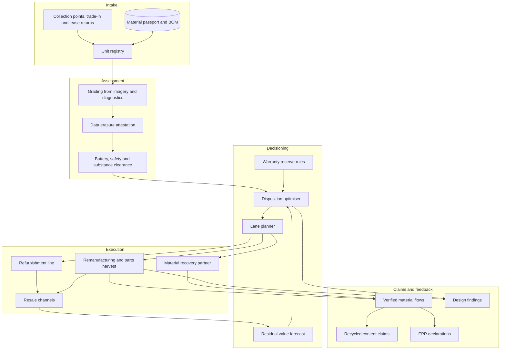

# Revaloop

**Source:** `ai-in-for-good/Artificial-intelligence-and-the-circular-economy/`
**Domain:** `ai-forgood`
**One-liner:** A disposition and residual-value system for durable-goods producers that decides, unit by unit, which next cycle a returned product should enter — resale, repair, refurbishment, parts harvesting for remanufacture, or material recovery — and commits that decision with a price, a warranty reserve, and the extended-producer-responsibility consequences attached.

**Wedge:** Consumer electronics take-back operations — smartphones, laptops, TVs and smart home devices — run by brands and their lifecycle-care partners handling 50,000 to 2 million returned units a year through trade-in, warranty exchange, lease return and device-as-a-service contracts.

**Positioning:** Reverse-logistics underwriting. Existing tools either grade a device (condition in, grade out) or price a used device (grade in, price out). Revaloop treats each returned unit as a small underwriting decision: given a graded condition, a bill of materials, a live secondary-market price surface, a remanufacturing yield history and an eco-modulated fee schedule, which next cycle maximises net recovery, and what reserve must be held against the warranty and compliance risk of choosing it.

## Market research synthesis

### Thesis from source

The source — an Ellen MacArthur Foundation paper built with Google and McKinsey on the back of more than 40 expert interviews — argues that the circular economy is a design problem, an operating-model problem and an infrastructure problem, and that AI accelerates all three: designing circular products, components and materials; operating circular business models; and optimising the infrastructure that closes the loop. It sizes the prize concretely. A circular economy in Europe is put at a net benefit of EUR 1.8 trillion by 2030. AI is credited with adding roughly USD 13 trillion to global economic activity by 2030. The circular-economy slice attributable to AI is estimated at up to USD 127 billion a year in 2030 for food and up to USD 90 billion a year for consumer electronics, the latter decomposed into use-period extension (USD 50 billion), e-waste recovery (USD 24 billion against a total e-waste market of USD 107 billion), material efficiency (USD 8 billion) and R&D optimisation (USD 8 billion).

The waste being addressed is measured, not rhetorical. The world produced 45 million tonnes of e-waste in 2016 holding an estimated EUR 55 billion of raw materials, of which only 20% was collected and recycled through channels that recover value without harming health or the environment; 80% of electronic waste is not treated appropriately, which the paper attributes to poor collection, technical complexity and the cost of recycling, remanufacturing and refurbishment. Consumer electronics alone contribute 10.5 million tonnes a year, with China discarding some 6 million tonnes of domestically consumed product annually. The infrastructure that exists for collection, disassembly, sorting and recycling is described as cumbersome, fragmented and labour intensive, which is precisely why so little value is recovered.

The paper's most product-shaped observation is a decision problem, stated almost as a specification. To choose the next use cycle for each returned product — reuse, recovering components through parts harvesting for remanufacture, or recycling — a company "would have to take into consideration a combination of factors regarding the product's condition, as well as the current market situation," and only with large quantities of product and customer data plus an analytical model to make sense of them "does such a decision-making model become feasible." It also names the two conditions that make the problem hard: fluctuating demand and supply of used products and components, and the widely varying condition of what comes back. Around that decision the paper assembles the inputs. Teleplan uses machine learning to grade cosmetic condition, distinguishing a feature such as a logo or speaker from an anomaly such as a scratch or dent, producing objective, consistent, reliable classification at lower cost per unit — and the paper is explicit that better grading is what gives wholesalers confidence to buy used stock. Refind classifies type and, where perceptible, condition of e-waste; ZenRobotics reaches 98% sorting accuracy across streams from plastic packaging to construction waste. Stuffstr's chief executive argues that pricing used products is "instrumental to boosting product circulation" because it both moves people to resell and shifts buying preference toward items that hold value, and that AI can price a complex variety of used products by taking account of market conditions and product characteristics such as age and brand. On the remanufacturing side, Professor Nabil Nasr states that intelligent assets make post-use condition assessment easier and more accurate, "reducing the costs of remanufacturing up to 75%."

The paper is equally clear about what blocks the loop, and each blocker becomes a product requirement rather than a caveat. Secondary-market uptake is limited by consumer fear that personal information remains on a device and by uncertainty about condition and fair pricing. Material data exists in volume but "much of the data is propriety and inaccessible," and 80–90% of all data is unstructured and unlabelled. Transparency with open or easy access to data is "required but rarely found," so the transition "can not be done by one company alone" and may need a central facilitating body across the value chain. E-waste arrives in many sizes, shapes and conditions, requiring tailored equipment settings, manual adjustment and consequent machine downtime. Design is the upstream lever: circularity requires disassembly, upgradability and recycled content to be designed in, with software compatibility maintained so working devices are not discarded, and personal data made easily transferable so reuse and device-as-a-service models work at all. Read together, these constraints describe a system of record for the reverse flow: a per-unit disposition decision, priced, evidenced, legally clean, and fed back into the next product programme.

### Buyer & economic model

- **Primary buyer:** VP or Director of Aftermarket and Circular Operations at a consumer-electronics brand, who owns trade-in, warranty exchange, refurbishment and end-of-use disposal; alternatively the managing director of a lifecycle-care provider selling take-back as a service to several brands. The co-signing economic buyer is the product-environmental-compliance director who owns extended-producer-responsibility (EPR) fees and recycled-content claims.
- **Users:** grading and triage technicians (per-unit, all day), reverse-logistics planners (daily lane and consolidation decisions), refurbishment and remanufacturing supervisors (job release and yield), trade-in pricing analysts (offer tables and market moves), warranty and quality engineers (failure risk on harvested parts), compliance analysts (declarations, movement permits, claim substantiation), and design-for-circularity engineers (next-generation findings).
- **Budget owner / value metric:** the aftermarket and reverse-logistics P&L. The primary value metric is net recovered value per returned unit after collection, processing, testing and warranty reserve — not gross resale price. Secondary metrics are eco-modulated EPR fee per unit placed on market, verified recycled-content tonnage, and the share of returns that avoid the scrap route entirely.
- **Competing status quo:** a cosmetic grading matrix applied by eye, a spreadsheet of broker bids for bulk lots, a standing scrap contract for everything below a threshold grade, trade-in offer tables refreshed quarterly from list prices, an annual EPR return assembled by hand from weight tables, and recycled-content claims asserted from supplier declarations no one can trace to a physical flow. Where the work is outsourced to a lifecycle-care partner, the brand receives invoices and tonnages but not the per-unit decisions, so it cannot tell whether value was recovered or merely cleared.

### Domain constraints

- **Regulatory / trust / safety:** EPR schemes with eco-modulated fees that reward disassembly time, repairability and recycled content; waste-electronics and battery reporting obligations; transboundary movement rules that make a cheaper processing lane in another jurisdiction illegal rather than merely inconvenient; consumer-law warranty duties that attach to refurbished goods sold as such; restricted-substance regimes that determine whether a harvested part may legally re-enter a new build; battery classification and transport rules that constrain consolidation; and greenwashing enforcement that turns an unsubstantiated recycled-content or "circular" claim into a legal exposure. The source's own barrier — consumer fear of residual personal data — makes certified erasure a precondition of resale, not a nicety.
- **Data sensitivity:** returned devices carry data traceable to their last user, so erasure must be evidenced while retaining no personal content, and grading imagery routinely captures serial numbers and screen contents. Bills of materials and material composition are supplier-confidential, matching the paper's finding that most material data is proprietary and inaccessible, so a material passport must be readable field by field on a need-to-know basis. Partner processors' cost structures are commercially sensitive and cannot be pooled into a shared price surface without contractual limits.
- **Change-management realities:** grading crews are paid per unit and trust their own eyes over a score; plant operators optimise for uptime, so any instruction that increases equipment changeovers will be ignored unless the yield gain is shown in the same view; brokers lose margin when residual value becomes transparent and will resist; design teams work 12 to 24 months ahead of the return flow, so feedback must arrive as a short ranked list of evidenced findings with money attached rather than as a data extract; and, as the paper concludes, no single company closes the loop alone, so the system must operate across a partner network under data-sharing agreements instead of assuming one owner of the whole chain.

## Business requirements

- BR-1: Every returned unit must carry a recorded disposition decision naming its next cycle and its expected net recovery, and no unit may be scrapped, downgraded or sold in a bulk lot without such a record and a stated reason.
- BR-2: Disposition must be priced, not classified: each decision must carry expected residual value, expected collection and processing cost, and — where resale, refurbishment or remanufacture is chosen — a warranty reserve, so recovery is reported net and comparable across routes.
- BR-3: Grading must be objective and reproducible to a published tolerance: two assessments of the same unit must agree within that tolerance, and disagreement must be settled by an evidenced re-grade with a recorded adjudication rather than by supervisor discretion.
- BR-4: No unit may be offered into a reuse market without evidenced data erasure and a safety and restricted-substance clearance, and the platform must be able to produce that evidence for an individual unit years later without having retained personal content.
- BR-5: Recycled-content, reuse and avoided-waste claims must be traceable to verified physical flows at unit or batch level, and any claim the platform cannot substantiate must be blocked from publication rather than footnoted.
- BR-6: EPR declarations must be generated from the same records that drive daily operations, with eco-modulation drivers reported per product model, so a fee movement is attributable to a design or process change rather than to a filing method.
- BR-7: Customer-facing take-back and trade-in offers must be economically defensible at the moment they are made: offer price plus expected collection cost may not exceed forecast net recovery beyond an explicitly approved risk budget, and breaches must require override with an owner.
- BR-8: Remanufacturing must be governed by yield and warranty economics: harvested parts must carry a predicted failure risk and an expected yield, and a part must be barred from re-entering a build when its warranty exposure exceeds the value it recovers.
- BR-9: Reverse-logistics lanes must be chosen on landed economics within legal movement constraints, and any lane that would breach waste-shipment, battery-transport or export rules must be unavailable for selection rather than merely flagged after the fact.
- BR-10: Each product cycle must receive a ranked set of design findings — disassembly effort, upgradability, part commonality, recycled-content feasibility — each tied to a quantified recovery loss observed in the return flow, so design-for-circularity investment is argued with measured money.
- BR-11: Partner refurbishers, remanufacturers and recyclers must be able to participate without surrendering their cost structures, and brand-confidential bill-of-materials fields must be disclosed selectively under recorded agreements.
- BR-12: Every disposition, claim, declaration and override must be reconstructable for the statutory record-keeping and audit window, including the decision model version and the market prices in force when the decision was made.

## User stories

Canonical user stories live in sibling [USER_STORIES.md](USER_STORIES.md).

## System design

### Overview

Revaloop runs the reverse flow as a decision pipeline with money attached at every step. A unit enters through a take-back offer, a warranty exchange, a lease return or a collection point and is registered against its product model and material passport. Assessment produces a graded condition from imagery, diagnostics and test results, together with erasure and safety clearances. The decision stage combines that condition with a residual-value forecast per candidate market, a remanufacturing yield history, a warranty reserve rule and the eco-modulation and movement constraints in force, then commits one next cycle: direct resale, repair-and-resale, refurbishment, parts harvesting for remanufacture, or material recovery. Execution dispatches the unit down a legal lane to the chosen internal or partner facility and records what actually happened — realised price, realised yield, warranty events, recovered material fractions. Those actuals feed three consumers: the forecasting models, the claims and declarations layer that turns verified flows into recycled-content statements and EPR filings, and the design-findings layer that tells the next product programme where recovery value was destroyed by design.

### Actors & boundaries

- **Actors:** grading technician, circular operations planner, remanufacturing and warranty engineer, residual pricing analyst, compliance and EPR analyst, design-for-circularity engineer, partner processor (refurbisher, remanufacturer, recycler), broker or secondary-market channel, and the returning customer.
- **Trust boundary:** the unit record is the shared object; the sensitive material sits on either side of it. Personal data is destroyed and only an erasure attestation crosses the boundary. Bill-of-materials and composition fields are brand and supplier confidential and are released field by field under recorded agreements. Partner cost structures stay with the partner; what the platform holds is the agreed price for a service, not the partner's margin. Claims published externally may only reference verified flows.
- **Human-in-the-loop points:** grade adjudication when an assessment is challenged or two assessments disagree; disposition override with a named owner when a planner departs from the recommended route; job release for remanufacturing batches; approval of offer tables and of any risk-budget breach; sign-off of EPR declarations and external claims; acceptance of design findings into a product programme.

### Core capabilities

1. **Intake and unit registry** — registers each returned unit against product model, bill of materials, material passport and the commercial route it arrived through, with provenance for lease, warranty and trade-in returns.
2. **Condition assessment and grading** — derives cosmetic and functional grade from imagery, diagnostics and test outcomes, separates model features from anomalies, and records reproducibility against the published tolerance.
3. **Clearance checks** — data erasure attestation, battery and safety status, restricted-substance status, and blocked-market rules; failure diverts the unit and closes the resale route.
4. **Residual value forecasting** — model, grade and market-level value forecasts with confidence bands, refreshed against realised sales, spare-part demand and secondary-material prices.
5. **Disposition decisioning** — selects the next cycle that maximises expected net recovery under capacity, legal and reserve constraints, and records the alternatives it rejected.
6. **Reverse-logistics lane planning** — ranks collection, consolidation and movement options on landed cost with unlawful movements excluded by construction.
7. **Remanufacturing yield and warranty reserve** — per-part yield expectations, predicted failure risk, reserve calculation, and blocking rules for parts that cannot be cleared.
8. **Take-back offer management** — builds and governs customer-facing offer tables against forecast net recovery and an approved risk budget.
9. **Claims and compliance reporting** — assembles recycled-content, reuse and avoided-waste claims from verified flows, and produces EPR declarations with eco-modulation drivers per model.
10. **Design feedback** — attributes recovery losses to design attributes and issues ranked findings to product programmes.
11. **Partner and access governance** — agreements, field-level disclosure of passport data, model-version records and audit reconstruction.

### Conceptual data

- **Primary entities:** ProductModel, BillOfMaterials, MaterialPassport, ReturnedUnit, GradingAssessment, ClearanceRecord, ResidualValueForecast, DispositionDecision, ReverseLogisticsLane, RemanufacturingJob, HarvestedPart, PartYieldRecord, WarrantyReserve, TakeBackOffer, RecoveredMaterialFlow, RecycledContentClaim, EprDeclaration, EcoModulationDriver, DesignFinding, PartnerFacility, DataSharingAgreement.
- **Critical events:** unit received and registered; assessment completed; grade challenged and adjudicated; erasure attested; clearance failed; disposition committed or overridden; lane dispatched; remanufacturing job released and closed; part harvested, cleared or blocked; unit sold with realised price; warranty event recorded against a reserve; material flow verified; claim published or blocked; declaration filed; design finding accepted or rejected.
- **Retention / audit needs:** disposition decisions, clearances, claims and declarations retained for the statutory producer-responsibility and warranty windows with the decision model version and price inputs attached, so a past decision can be reconstructed exactly. Erasure attestations are retained while the personal content they refer to is not. Grading imagery is retained under a shorter window with serial and screen regions redacted for any use beyond adjudication. Partner cost terms and passport disclosures are retained as agreement-scoped records rather than as open fields.

### Integrations (conceptual)

- **Systems of record:** product lifecycle management and engineering bills of materials, ERP and inventory for spare parts and finished refurbished stock, warranty and service management systems, warehouse management at refurbishment and recycling sites, finance for reserves and recovery reporting, and the EPR compliance scheme portals that receive declarations.
- **Upstream signals:** device diagnostics and telemetry from intelligent assets, grading imagery and sensor output from inspection cells and sorting robots, secondary-market and broker price feeds, spare-part demand signals, secondary raw-material prices, supplier composition declarations, and the eco-modulation fee schedules published by producer-responsibility organisations.
- **Downstream actions:** trade-in offer publication to retail and e-commerce channels, work orders to refurbishment and remanufacturing lines, sorting-equipment settings and batch profiles for recycling partners, shipment instructions on approved lanes, listing and pricing instructions to resale channels, reserve postings to finance, declarations to compliance schemes, and design findings into product programme backlogs.

### High-level architecture

Assessment is a high-volume, per-unit path; decisioning is a priced path that must be reproducible years later; claims and design feedback are aggregation paths built only from verified flows. Separating them keeps the grading line fast without weakening the evidentiary value of a disposition record.

### Success metrics

- **Leading:** share of returned units with a priced disposition decision before physical movement; grading reproducibility within published tolerance; median hours from receipt to committed disposition; share of units cleared for reuse on first pass versus diverted by erasure or safety failure; forecast error on residual value at 30 days; remanufacturing yield variance against prediction; share of claims backed by verified flows at first submission.
- **Lagging:** net recovered value per returned unit after collection, processing and warranty reserve; share of returns avoiding the scrap route, measured against the source's finding that only 20% of e-waste is recycled through value-recovering channels; warranty cost per refurbished unit sold and per remanufactured part; eco-modulated EPR fee per unit placed on market; verified recycled-content tonnage entering new builds; recovery loss attributable to design attributes, cycle over cycle, as design findings are adopted.

## OpenAPI skeleton

Canonical HTTP surface lives in sibling [openapi.yaml](openapi.yaml). Summary:

- **Base path:** `/v1/...`
- **Auth:** `X-API-Key` for machine-to-machine integration from grading cells, partner facilities and channel systems; Bearer JWT for operator consoles and approvals.
- **Resource groups:** Units, Assessment, Disposition, Logistics, Remanufacturing, Valuation, Compliance, Design.
