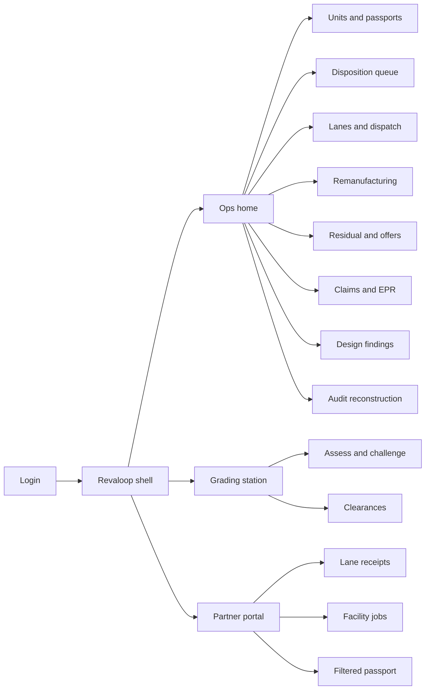
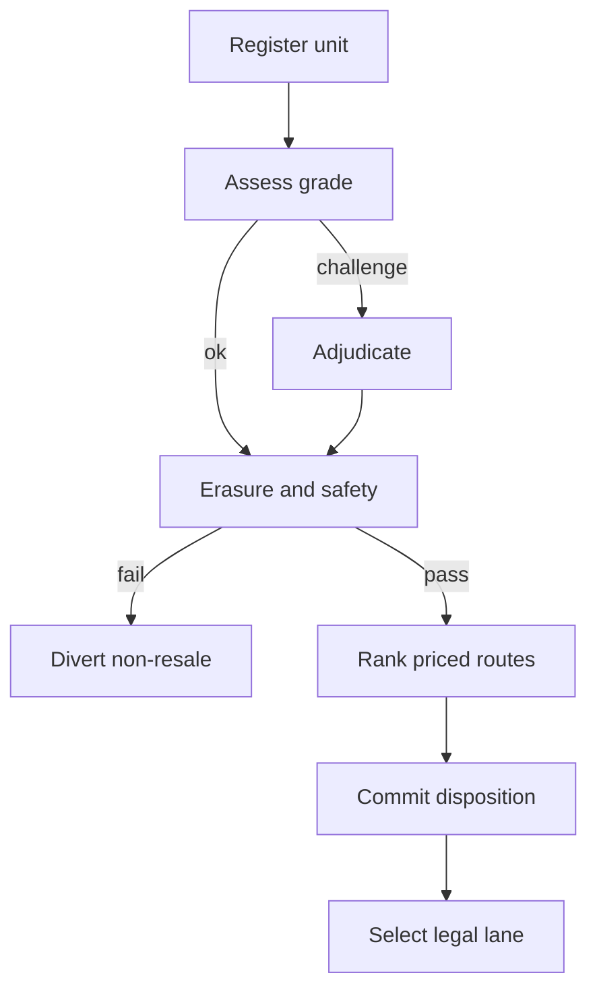
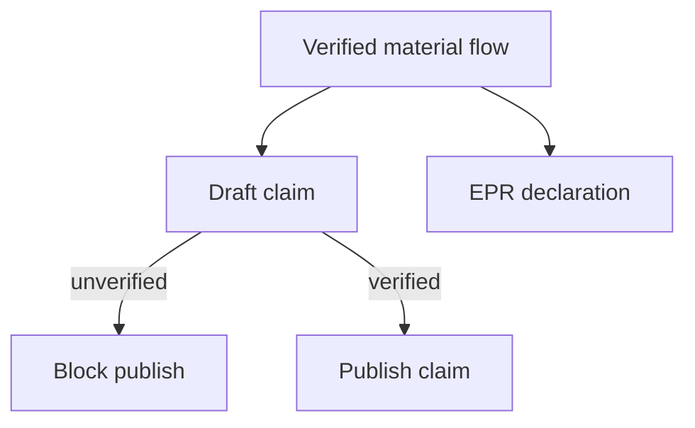

# Revaloop — Web app

**Product:** [PRODUCT.md](./PRODUCT.md)
**Primary surface:** Circular operations console (disposition underwriting for returned electronics)
**Secondary surfaces:** Grading-station companion view (high-throughput, keyboard-first); partner facility portal (lane receipts, job status, field-filtered passport); read-only claim / EPR export packet viewer
**Design thesis:** Revaloop is reverse-logistics underwriting, not a green-marketing dashboard. Each returned unit is a small policy: grade in, clearances in, residual surface in, next cycle and reserve out. The UI metaphor is an underwriting desk beside a plant floor — cool industrial oxide and copper confirmation on a deep charcoal ground, with cycle routes drawn as committed lanes rather than “insights” tiles. The Revaloop wordmark sits like a mint mark on every money-bearing and claim-bearing screen so operators know whose decision record they are trusting years later.

## UX research synthesis

### Category peers (best-in-class)

- **Optoro (returns / reverse logistics):** Disposition routing that treats each return as an economic choice across resale, liquidation, and recycle lanes, with bulk and unit views. Steal: next-route recommendation with expected recovery beside the physical unit; reject Optoro’s retail-returns merchandising chrome where Revaloop’s object is a manufacturer take-back unit with EPR consequences.
- **Blancco (certified erasure):** Evidence-first erasure certificates that survive audits without retaining personal content. Steal: clearance as a hard gate before any reuse offer; attestation detail that is exportable per unit years later; reject consumer “wipe complete” toasts that lack reconstructable proof.
- **Circularise / Catena-X-style digital product passports:** Field-level material disclosure under data-sharing agreements rather than a single open BOM dump. Steal: passport panes that omit fields the caller is not entitled to see (not greyed secrets); partner-scoped views; reject open blockchain explorer aesthetics that imply public transparency the brand cannot grant.
- **Foxway / recommerce grading lines (and similar OEM take-back ops UIs):** High-throughput cosmetic + functional grading with feature-vs-anomaly discipline. Steal: image-led grade proposal with challenge/adjudication; station density over dashboard chrome; reject vanity “AI confidence” rings that replace reproducible tolerance.

### Patterns to adopt / reject

- **Adopt:** Unit as the primary object; priced disposition (value − cost − reserve) as the default KPI; clearance gates that close routes rather than warn; illegal lanes unavailable by construction; claim publish blocked when flows are unverified; design findings ranked by quantified recovery loss; partner views without partner margin disclosure.
- **Reject:** Sustainability scorecards as the home; purple “circular AI” glow panels; editable recycled-content totals; scrap as a silent default without a recorded reason; broker-lot bulk clearing without per-unit decisions; dashboard-of-everything that mixes plant floor with marketing claims.

### Trust, density, and workflow constraints from PRODUCT.md

Grading crews are paid per unit and will ignore any UI that slows throughput or contradicts what they can see (BR-3). Disposition must be priced and reconstructable with model version and market prices in force (BR-2, BR-12). Resale is legally blocked without erasure and safety/substance clearance (BR-4). Claims and EPR filings must come from the same operational record as daily decisions (BR-5, BR-6) — marketing cannot publish what verification will not support. Partner processors and supplier BOM fields stay need-to-know (BR-11). Design feedback must arrive as a short ranked list with money attached, not a data extract (BR-10).

## Information architecture

### Nav model

### Roles → default home

| Role | Default home | Why |
|------|--------------|-----|
| Grading / triage technician | Grading station | Per-unit throughput all day (BR-3, BR-4) |
| Circular operations planner | Ops home — disposition queue | Commit capacity to routes with net recovery (BR-1, BR-2, BR-9) |
| Remanufacturing / warranty engineer | Remanufacturing jobs | Yield and reserve before release (BR-8) |
| Residual pricing analyst | Residual forecasts and offer tables | Defensible trade-in economics (BR-7) |
| Compliance / EPR analyst | Claims and EPR | Filings from operational record (BR-5, BR-6) |
| Design-for-circularity engineer | Design findings | Ranked recovery-loss list (BR-10) |
| Partner facility operator | Partner portal | Participate without surrendering cost structure (BR-11) |
| Platform / audit admin | Audit reconstruction | Model version + price inputs (BR-12) |

### Cross-links to OpenAPI resources

| Nav area | OpenAPI tags / resources |
|----------|---------------------------|
| Units and passports | Units |
| Assess, challenge, clearances | Assessment |
| Disposition queue / override | Disposition |
| Lanes and dispatch | Logistics |
| Remanufacturing jobs / parts | Remanufacturing |
| Residual forecasts / take-back offers | Valuation |
| Material flows, claims, EPR | Compliance |
| Design findings | Design |

## Screen inventory

### Ops home

- **Purpose:** Answer “is today’s return flow being underwritten before it moves, and where is net recovery leaking?” in one composition.
- **Entry:** Post-login for planner / aftermarket leadership; deep link from overnight batch alerts.
- **Layout regions:** Brand + site switcher; primary strip (units with priced disposition before movement, net recovery vs scrap share, clearance divert rate, forecast error at 30 days); disposition backlog by next cycle; alerts rail (illegal-lane attempts blocked, claim blocks, offer-table risk breaches).
- **Primary actions:** Open disposition queue; open uncleared units; jump to claim blocks.
- **Empty / loading / error:** Empty = guided “register first intake batch”; loading = skeleton strip + queue; error = retry with request id.
- **BR / story ties:** BR-1, BR-2; planner stories on route split and recovery loss.

### Unit registry and material passport

- **Purpose:** Register each returned unit against model, intake route, and field-filtered passport — the shared object across partners.
- **Entry:** Ops nav → Units; API-fed intake with console review.
- **Layout regions:** Filterable unit table (status, model, intake route, disposition); unit detail with provenance; passport pane (only entitled fields); BOM disclosure agreement indicator.
- **Primary actions:** Open unit; view passport as partner would see it; attach intake exception.
- **Empty / loading / error:** Missing passport fields = omit (not mask); agreement absent = partner fields unavailable banner.
- **BR / story ties:** BR-11, BR-12; intake capability.

### Grading station

- **Purpose:** High-throughput cosmetic and functional grading with feature-vs-anomaly proposals and challenge adjudication.
- **Entry:** Technician login default; barcode/scan entry.
- **Layout regions:** Live unit header; image/diagnostic canvas; proposed grade with tolerance band; feature vs anomaly callouts; challenge control; next-unit queue.
- **Primary actions:** Accept grade; challenge with evidence; send to clearance.
- **Empty / loading / error:** Empty = wait for next scan; disagreement = forced re-grade path with recorded adjudication (not supervisor override alone).
- **BR / story ties:** BR-3; technician stories.
- **Mobile notes:** Tablet landscape for inspection cells; large hit targets; offline queue not in v1 web.

### Clearance gate

- **Purpose:** Erasure, battery/safety, and restricted-substance status — failures close resale routes automatically.
- **Entry:** After assessment; unit detail → Clearances.
- **Layout regions:** Clearance checklist with attestation ids; blocked-market rules; divert destination when failed; exportable evidence package (no personal content).
- **Primary actions:** Record attestation; divert; export clearance packet.
- **Empty / loading / error:** Pending erasure = resale route greyed and unselectable; failure = coral divert banner.
- **BR / story ties:** BR-4; technician divert story.

### Disposition decision desk

- **Purpose:** Commit one next cycle with expected residual value, processing cost, warranty reserve, and rejected alternatives — underwriting, not classification.
- **Entry:** Ops nav → Disposition; unit after clearance.
- **Layout regions:** Candidate routes ranked by expected net recovery; cost/value/reserve breakdown; capacity and legal constraints; rejected alternatives with reason codes; override panel requiring named owner.
- **Primary actions:** Commit disposition; override with reason; open lane planner.
- **Empty / loading / error:** No legal route = blocking state with compliance contact; loading = skeleton ranked list.
- **BR / story ties:** BR-1, BR-2, BR-8, BR-9, BR-12.

### Lanes and dispatch

- **Purpose:** Rank reverse-logistics options on landed cost; unlawful waste-shipment / battery / export movements unavailable for selection.
- **Entry:** After disposition; Logistics nav.
- **Layout regions:** Origin/destination matrix; landed-cost ranking; legal exclusion reasons; dispatch list; consolidation suggestions.
- **Primary actions:** Select lane; dispatch; print/send shipment instruction.
- **Empty / loading / error:** All lanes illegal = hard stop (not soft flag); integration error with WMS as blocking banner.
- **BR / story ties:** BR-9; planner lane stories.

### Remanufacturing and harvested parts

- **Purpose:** Release jobs only when predicted yield and warranty reserve economics clear; block parts that fail substance/safety.
- **Entry:** Remanufacturing nav; engineer default.
- **Layout regions:** Job queue; per-part yield prediction; failure-risk and reserve; block list; job close with realised yield.
- **Primary actions:** Release job; block part; close job; open warranty event against reserve.
- **Empty / loading / error:** Empty = no batches ready; part over reserve threshold = barred from build with explicit reason.
- **BR / story ties:** BR-8; remanufacturing and warranty engineer stories.

### Residual forecasts and take-back offers

- **Purpose:** Model/grade/market residual forecasts with confidence bands; govern customer-facing offer tables against risk budget.
- **Entry:** Valuation nav; pricing analyst default.
- **Layout regions:** Forecast grid with confidence; realised-vs-forecast chart; offer table editor; risk-budget meter; breach approval workflow.
- **Primary actions:** Publish offer table; reject table over budget; request override approval.
- **Empty / loading / error:** Thin market data = wide confidence band warning; breach without owner = cannot publish.
- **BR / story ties:** BR-7; pricing analyst stories.

### Claims and EPR workspace

- **Purpose:** Assemble recycled-content, reuse, and avoided-waste claims from verified flows; generate EPR declarations with eco-modulation drivers per model.
- **Entry:** Compliance nav; compliance default home.
- **Layout regions:** Verified material-flow ledger; claim draft with substantiate/block state; EPR declaration builder; eco-modulation driver attribution to design/process changes; sign-off.
- **Primary actions:** Verify flow; publish claim; block unsubstantiated claim; file declaration; export packet.
- **Empty / loading / error:** Unverified flow = publish control disabled; empty period = “no verified tonnage.”
- **BR / story ties:** BR-5, BR-6; compliance stories.

### Design findings

- **Purpose:** Ranked, money-attached findings (disassembly effort, upgradability, part commonality, recycled-content feasibility) for the next product programme.
- **Entry:** Design nav; design engineer default.
- **Layout regions:** Ranked finding list with quantified recovery loss; evidence from return flow; accept/reject into programme backlog; cycle-over-cycle trend.
- **Primary actions:** Accept finding; reject with note; export programme packet.
- **Empty / loading / error:** Empty = insufficient closed dispositions for model; not a blank marketing void.
- **BR / story ties:** BR-10; planner and design stories.

### Partner facility portal

- **Purpose:** Let refurbishers, remanufacturers, and recyclers receive lanes and update jobs without seeing brand-confidential BOM fields or peer cost structures.
- **Entry:** Partner login.
- **Layout regions:** Lane receipts; facility job status; filtered passport; agreed service price (not partner margin); disclosure agreement badge.
- **Primary actions:** Confirm receipt; update job; request additional entitled field.
- **Empty / loading / error:** No active agreement = empty with contract CTA; omitted fields unexplained as secrets.
- **BR / story ties:** BR-11.

### Audit reconstruction

- **Purpose:** Reproduce any disposition, claim, declaration, or override with decision-model version and market prices then in force.
- **Entry:** Ops / admin Audit.
- **Layout regions:** Search by unit, claim, or declaration id; timeline of critical events; model version and price snapshot; export for statutory window.
- **Primary actions:** Reconstruct decision; export audit pack; open related clearances.
- **Empty / loading / error:** Outside retention window = explicit expiry state; attestation failure = coral blocking.
- **BR / story ties:** BR-12.

## Key flows

1. **Unit to committed disposition** — register → assess → adjudicate if challenged → clear erasure/safety → price routes → commit next cycle → select legal lane; failure: clearance fail diverts from resale; illegal lane unavailable.

2. **Trade-in offer governance** — forecast residual → draft offer table → check risk budget → publish or require named override; failure: expected loss over budget blocks publish (BR-7).

3. **Remanufacturing release** — batch with yield prediction → reserve check → release or bar part → close with realised yield → feed forecast and design findings (BR-8).

4. **Claim publish or block** — verified material flow → draft claim → substantiate or block → optional EPR declaration from same record (BR-5, BR-6).

5. **Design finding adoption** — closed dispositions attribute recovery loss → ranked finding → programme accept/reject with money evidence (BR-10).

## Design system

### Tokens (CSS variables)

- `--color-ink: #E6E2DC` — primary text on dark ground
- `--color-charcoal-950: #0E1110` — app ground
- `--color-charcoal-900: #161A18` — panels
- `--color-charcoal-700: #2C3430` — rules/dividers
- `--color-oxide: #C45C26` — copper accent for committed disposition / recovered value
- `--color-oxide-dim: #6B3418` — copper on dark
- `--color-sage: #7A9E7E` — clearance pass / verified flow
- `--color-amber: #D4A017` — grade challenge / provisional / risk-budget watch
- `--color-coral: #D94F3D` — clearance fail / illegal lane / claim block
- `--color-steel: #8A9490` — secondary labels
- `--color-brand: #E0C4A8` — Revaloop wordmark (warm oxide-light, not neon)
- `--font-display: "IBM Plex Sans", sans-serif` — console chrome and recovery numerals
- `--font-mono: "IBM Plex Mono", monospace` — unit ids, attestation ids, model versions, declaration refs
- `--space-1`…`--space-8`: 4px scale
- `--radius-sm: 4px`; `--radius-md: 8px` — industrial, not pill-heavy
- `--motion-commit: 200ms ease-out` — disposition commit flash on oxide
- `--motion-divert: 240ms ease-in-out` — coral pulse on clearance divert
- `--motion-station: 120ms linear` — grading station next-unit advance
- Atmosphere: subtle brushed-metal horizontal grain in charcoal-900 (plant / underwriting desk), soft top vignette; console imagery is grading photos and lane maps, not stock “green planet” heroes.

### Typography & brand

- Display for net-recovery numerals and screen titles; mono for unit ids, attestation hashes, EPR refs, model versions.
- Brand wordmark left of shell chrome on every money-bearing and claim-bearing view; never replaced by a generic “Sustainability” title as the strongest mark.
- Login shell: brand as hero-level signal; one headline (“Underwrite the next cycle”); one CTA — no tonnage stat strips.

### Do / don’t

- **Do:** Show priced net recovery on every disposition; treat settled/committed decisions as reconstructable; omit unentitled passport fields; disable illegal lanes and unsubstantiated publish; keep grading station dense and keyboard-friendly.
- **Don’t:** Purple circular-AI glow; editable claim totals; scrap without recorded reason; rainbow ESG tile grids; card grids for static sustainability scores; emoji status; rounded-full pills for every filter.

### Accessibility & domain trust cues

- Contrast AA+ on oxide/sage/amber/coral against charcoal; never colour-alone — committed rows show lock + “Committed”; blocked claims show “Blocked” text + icon.
- Live regions announce clearance divert, illegal-lane exclusion, and claim-block events.
- Focus order follows underwriting flow: unit → grade → clearance → disposition → lane → claim.
- Audit export is machine-readable for statutory reconstruction.

## Component patterns

- **UnitUnderwritingHeader** — model, intake route, status, clearance chips, net recovery when disposed.
- **GradeToleranceBand** — proposed grade vs published reproducibility tolerance with challenge affordance.
- **FeatureAnomalyCallout** — distinguishes logo/speaker/camera ring from scratch/dent on imagery.
- **ClearanceGateStrip** — erasure / safety / substance with divert on fail.
- **DispositionRouteRank** — ranked next cycles with value, cost, reserve, and rejected alternatives.
- **IllegalLaneExclusion** — unavailable lane with regulatory reason (not a soft warning).
- **RiskBudgetMeter** — offer-table expected loss vs approved budget.
- **VerifiedFlowLedgerRow** — material flow verification state feeding claims.
- **ClaimPublishControl** — enabled only when substantiated; otherwise blocked state.
- **PassportFieldFilter** — agreement-scoped fields; omit rather than mask.
- **DesignFindingRankRow** — recovery-loss money + design attribute + accept/reject.
- **AuditReplayPanel** — model version + price snapshot at decision time.

## Out of scope for v1 web

- Native grading-cell firmware UI; sorting-robot teach pendant; broker marketplace storefront; consumer trade-in retail UX beyond offer-table publication APIs; full PLM authoring; headset AR disassembly guides; multi-brand white-label portals beyond partner field filtering; replacement of WMS or EPR scheme portals (export/file into them instead).
